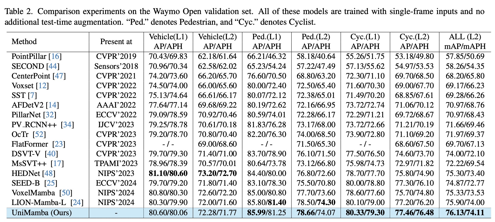
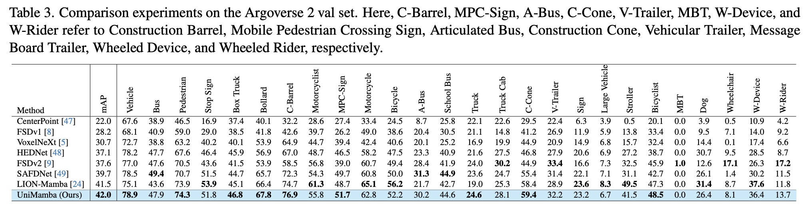

<div align="center">

<h1>UniMamba</h1>
<h3>Unified Spatial-Channel Representation Learning with Group-Efficient Mamba for LiDAR-based 3D Object Detection</h3>

Xin Jin<sup>♠️,2,3</sup>, [Haisheng Su](https://scholar.google.com.hk/citations?user=OFrMZh8AAAAJ&hl=zh-CN)<sup>♠️,1,3 :email:</sup>, Kai Liu<sup>3</sup>, Cong Ma<sup>3</sup>, [Wei Wu](https://scholar.google.com.hk/citations?hl=zh-CN&user=9RBxtd8AAAAJ)<sup>3</sup>, Fei HUI<sup>3 :email:</sup>, [Junchi Yan](https://thinklab.sjtu.edu.cn/)<sup>1 :email:</sup>

<sup>1</sup> School of Computer Science, Shanghai Jiao Tong University

<sup>2</sup> Chang'an University, <sup>3</sup> SenseAuto Research

♠️ : Equal Contribution

:email:: Corresponding author


<!--  -->


</div>


## News
* **` Mar. 9th, 2025`:** We released our paper on Arxiv. Code/Models  are coming soon. Please stay tuned! ☕️
* **` Mar. 9th, 2025`:** Our paper has been accepted to CVPR 2025!

<!-- [Arxiv](https://arxiv.org/abs/2409.09777) -->

## Table of Contents
- [Introduction](#introduction)
- [Framework](#framework)
- [Evaluation on nuScenes dataset](#evaluation-on-nuscenes-dataset)
- [Evaluation on Waymo Open dataset](#evaluation-on-waymo-open-dataset)
- [Evaluation on Argoverse2 dataset](#evaluation-on-argoverse2-dataset)
- [License](#license)
- [Contact](#contact)
- [Citation](#citation)


## Introduction
<div align="center">

</div>
Recent advances in LiDAR 3D detection have demonstrated the effectiveness of Transformer-based frameworks in capturing the global dependencies from point cloud spaces, which serialize the 3D voxels into the flattened 1D sequence for iterative self-attention. However, the spatial structure of 3D voxels will be inevitably destroyed during the serialization process. Besides, due to the considerable number of 3D voxels and quadratic complexity of Transformers, multiple sequences are grouped before feeding to Transformers, leading to a limited receptive field. Inspired by the impressive performance of State Space Models (SSM) achieved in the field of 2D vision tasks, in this paper, we propose a novel Unified Mamba (UniMamba), which seamlessly integrates the merits of 3D convolution and SSM in a concise multi-head manner, aiming to perform "local and global" spatial context aggregation efficiently and simultaneously. Specifically, a UniMamba block is designed which mainly consists of spatial locality modeling, complementary Z-order serialization and local-global sequential aggregator. The spatial locality modeling module integrates 3D submanifold convolution to capture the dynamic spatial position embedding before serialization. Then the efficient Z-order curve is adopted for serialization both horizontally and vertically. Furthermore, the local-global sequential aggregator adopts the channel grouping strategy to efficiently encode both ``local and global" spatial inter-dependencies using multi-head SSM. Additionally, an encoder-decoder architecture with stacked UniMamba blocks is formed to facilitate multi-scale spatial learning hierarchically. Extensive experiments are conducted on three popular datasets: nuScenes, Waymo and Argoverse 2. Particularly, our UniMamba achieves 70.2 mAP on the nuScenes dataset.


## Framework

<div align="center">

</div>

## Evaluation on nuScenes dataset
<div align="center"></div>

## Evaluation on Waymo Open dataset
<div align="center"></div>

## Evaluation on Argoverse2 dataset
<div align="center">

</div>


## Getting Started
TBD

## License
This project is released under the [MIT license](./LICENSE)


## Contact
If you have any questions, please contact [Haisheng Su](https://scholar.google.com.hk/citations?user=OFrMZh8AAAAJ&hl=zh-CN) via email (suhaisheng@sjtu.edu.cn).


## Citation
If you find UniMamba is useful in your research or applications, please consider giving us a star 🌟 and citing it by the following BibTeX entry.

<!-- ```bibtex
@article{su2024difsd,
  title={DiFSD: Ego-Centric Fully Sparse Paradigm with Uncertainty Denoising and Iterative Refinement for Efficient End-to-End Self-Driving},
  author={Su, Haisheng and Wu, Wei and Yan, Junchi},
  journal={arXiv preprint arXiv:2409.09777},
  year={2024}
}

``` -->

```